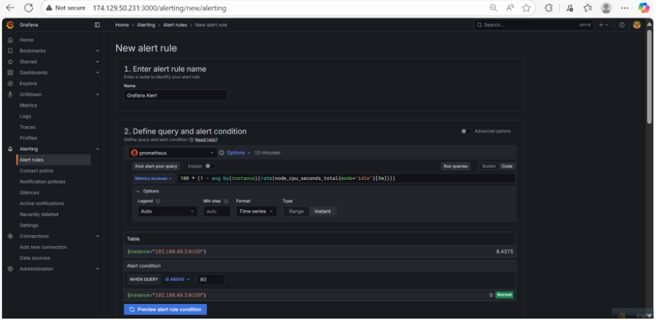
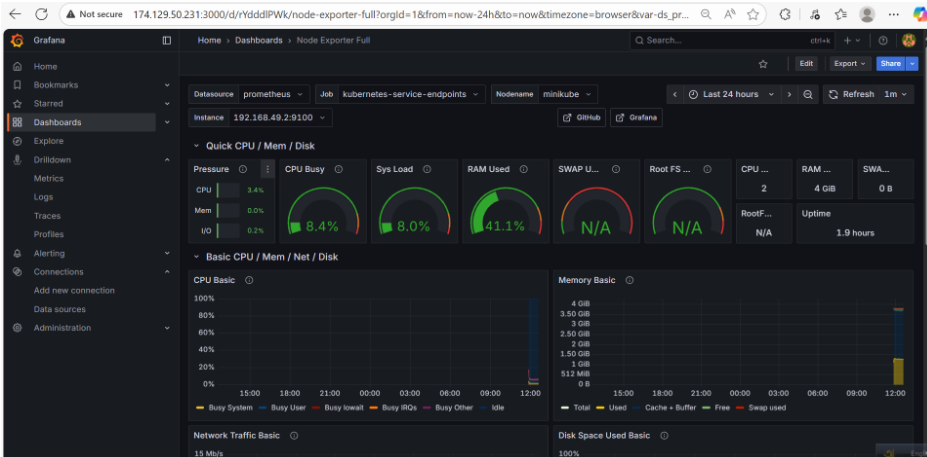

# Monitoring & Logging Setup with Kubernetes

## Objective

In this assignment, we set up monitoring and logging for a Kubernetes cluster using **Prometheus**, **Loki**, and **Grafana**. We deployed a sample application (Nginx), monitored its performance, and collected its logs for visualization.

---

## 1. Cluster Setup

We used **Minikube** on an EC2 instance to set up the Kubernetes cluster.

```bash
# Install Minikube
curl -LO https://github.com/kubernetes/minikube/releases/latest/download/minikube-linux-amd64
sudo install minikube-linux-amd64 /usr/local/bin/minikube && rm minikube-linux-amd64

# Start Minikube with Docker driver
minikube start --driver=docker
```

We also installed **kubectl**:

```bash
curl -LO "https://dl.k8s.io/release/$(curl -L -s https://dl.k8s.io/release/stable.txt)/bin/linux/amd64/kubectl"
curl -LO "https://dl.k8s.io/release/$(curl -L -s https://dl.k8s.io/release/stable.txt)/bin/linux/amd64/kubectl.sha256"
echo "$(cat kubectl.sha256)  kubectl" | sha256sum --check
sudo install -o root -g root -m 0755 kubectl /usr/local/bin/kubectl
kubectl version --client
```

**Screenshot:**


---

## 2. Application Deployment (Nginx)

We created a deployment YAML file:

```yaml
apiVersion: apps/v1
kind: Deployment
metadata:
  name: nginx-deployment
  labels:
    app: nginx
spec:
  replicas: 2
  selector:
    matchLabels:
      app: nginx
  template:
    metadata:
      labels:
        app: nginx
    spec:
      containers:
        - name: nginx
          image: nginx:latest
          ports:
            - containerPort: 80
---
apiVersion: v1
kind: Service
metadata:
  name: nginx-service
spec:
  selector:
    app: nginx
  ports:
    - port: 80
      targetPort: 80
  type: NodePort
```

Apply deployment and service:

```bash
kubectl apply -f nginx-deploy.yaml
kubectl get all
```

Port-forward to access externally:

```bash
nohup kubectl port-forward svc/nginx-service 8080:80 --address 0.0.0.0 > nginx.log 2>&1 &
```

Access URL: `http://<EC2_PUBLIC_IP>:8080`

**Screenshot:**


---

## 3. Prometheus Setup

Install Prometheus via Helm:

```bash
sudo snap install helm --classic
helm repo add prometheus-community https://prometheus-community.github.io/helm-charts
helm repo update
helm install prometheus prometheus-community/prometheus --namespace monitoring --create-namespace
kubectl get pods -n monitoring
```

Port-forward Prometheus:

```bash
nohup kubectl port-forward -n monitoring svc/prometheus-server 9090:80 --address 0.0.0.0 > prometheus.log 2>&1 &
```

Access URL: `http://<EC2_PUBLIC_IP>:9090`

**Screenshot:**


Prometheus monitors:

* Cluster metrics (CPU, memory, disk, pods)
* Nginx application metrics

---

## 4. Loki & Promtail Setup

Install Loki stack via Helm:

```bash
helm repo add grafana https://grafana.github.io/helm-charts
helm repo update
helm install loki grafana/loki-stack --namespace monitoring
```

Port-forward Loki:

```bash
nohup kubectl port-forward -n monitoring svc/loki 3100:3100 --address 0.0.0.0 > loki.log 2>&1 &
```

Promtail collects logs from pods (Nginx) and sends them to Loki.

Access Loki: `http://<EC2_PUBLIC_IP>:3100`

**Screenshot (example log check):**


---

## 5. Grafana Integration

Install Grafana via Helm:

```bash
helm install grafana grafana/grafana --namespace monitoring
kubectl get secret -n monitoring grafana -o jsonpath="{.data.admin-password}" | base64 --decode ; echo
```

Port-forward Grafana:

```bash
nohup kubectl port-forward -n monitoring svc/grafana 3000:80 --address 0.0.0.0 > grafana.log 2>&1 &
```

Access URL: `http://<EC2_PUBLIC_IP>:3000`

Login: `admin / <decoded password>`

Add data sources:

* Prometheus: `http://localhost:9090`
* Loki: `http://localhost:3100`

**Screenshots:**



---

## 6. Node Exporter

* Installed automatically with Prometheus Helm chart
* Collects **node-level metrics**: CPU, memory, disk, network

**Screenshot:**


---

## 7. Summary of Tools

| Tool              | Purpose                                                                   |
| ----------------- | ------------------------------------------------------------------------- |
| **Prometheus**    | Collects metrics from cluster nodes and pods                              |
| **Node Exporter** | Collects host/node-level metrics (CPU, memory, disk, network)             |
| **Loki**          | Centralized log aggregation from pods via Promtail                        |
| **Promtail**      | Agent to read pod logs and send to Loki                                   |
| **Grafana**       | Visualization and dashboarding of metrics and logs from Prometheus & Loki |

---

## 8. Access Summary

| Service    | URL                         |
| ---------- | --------------------------- |
| Nginx      | http://<EC2_PUBLIC_IP>:8080 |
| Prometheus | http://<EC2_PUBLIC_IP>:9090 |
| Loki       | http://<EC2_PUBLIC_IP>:3100 |
| Grafana    | http://<EC2_PUBLIC_IP>:3000 |

> Replace `<EC2_PUBLIC_IP>` with your EC2 instance public IPv4 (e.g., `174.129.50.231`)

---

## 9. References

* [Prometheus Helm Chart](https://prometheus-community.github.io/helm-charts)
* [Grafana Helm Chart](https://grafana.github.io/helm-charts)
* [Loki Helm Chart](https://grafana.github.io/helm-charts)

---

### ✅ Deliverables Included

* `images/Application_running_in_cluster.png`
* `images/Prometheus_metrics_dashboard.png`
* `images/Node_Exporter.png`
* `images/Grafana_metrics_dashboard.png`
* `images/Grafana-alerting.png`

---

**End of Documentation**
